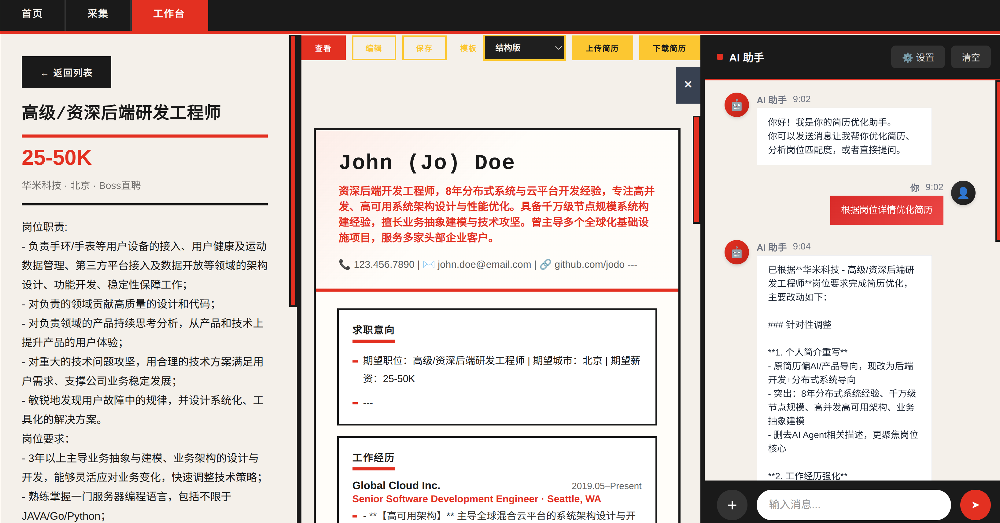
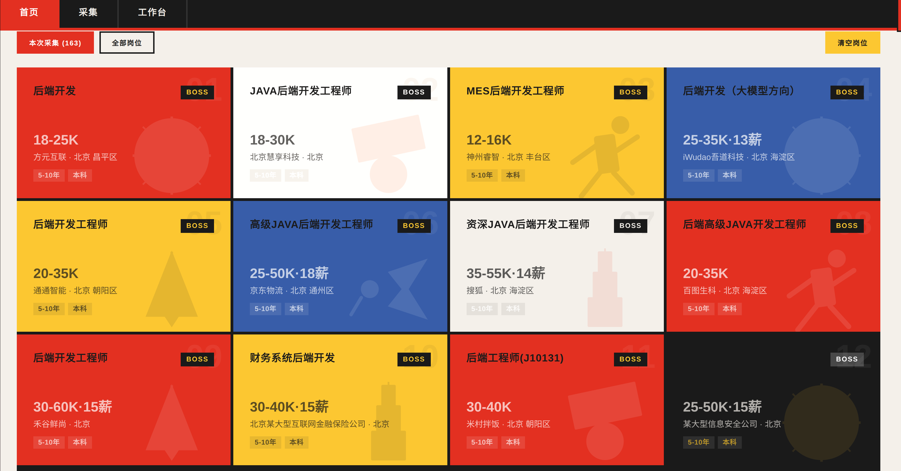
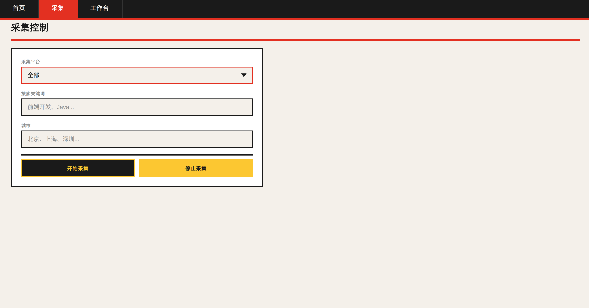
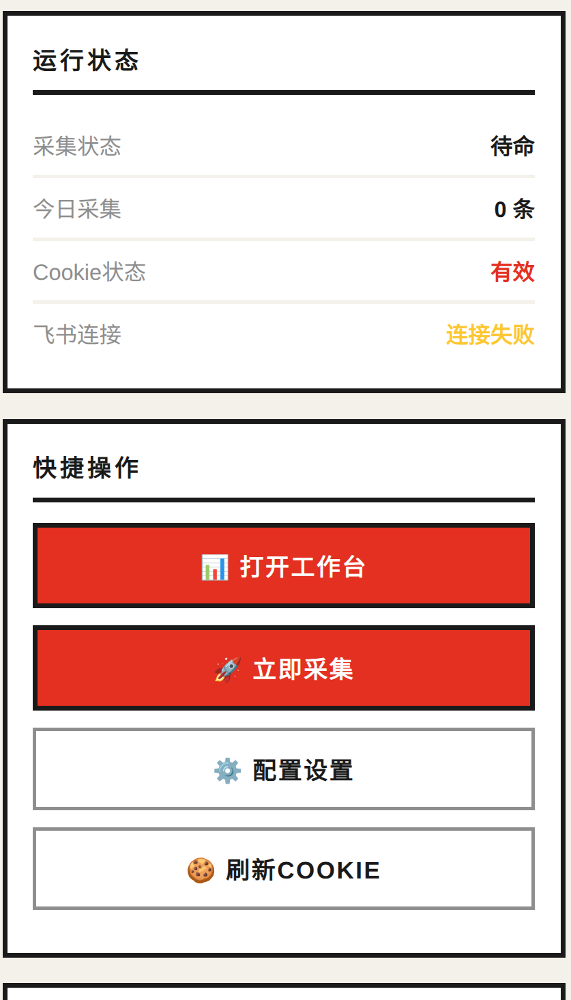

# 🎯 招聘工作台 (JobHunter)

> 一站式求职效率工具 —— 岗位采集 · 简历管理 · AI 助手

<p align="center">
  
  
  
  
  
</p>

---

## 📸 界面预览

### 三栏工作台：岗位详情 · 简历预览 · AI 助手

<p align="center">
  
</p>

> 左栏浏览岗位详情，中栏实时预览简历，右栏 AI 助手帮你分析和修改简历。

### 岗位总览 · 采集控制 · 扩展状态

<p align="center">
  
  
</p>
<p align="center">
  
</p>

> 卡片式岗位列表一目了然，采集面板支持自定义城市/关键词，弹窗随时查看运行状态。

---

## ✨ 功能亮点

### 📋 岗位采集
- **Boss 直聘 + 51Job + 智联招聘三平台**：自动采集岗位列表与详情，支持多城市、多关键词
- **V2 缓冲策略**：大页列表 + 小批详情交替模式，规避反爬风控
- **自动去重**：基于 encryptJobId / 标题+公司+薪资 三级去重
- **断点续爬**：反爬触发后自动冷却 → 策略轮转 → 续跑
- **CLI 支持**：`curl -X POST http://127.0.0.1:7893/enqueue -d '{"city":"北京","keyword":"产品经理"}'`

### 📝 简历管理
- **6 套专业模板**：structured / timeline / modern / classic / compact / elegant，一键切换
- **所见即所得编辑**：可视化编辑简历内容，实时预览
- **DOCX 上传解析**：上传 Word 简历自动提取结构化内容
- **PDF 导出**：一键生成高质量 PDF 简历，自动分页

### 🤖 AI 助手（支持 8+ 模型）
- **多模型支持**：智谱 GLM · OpenAI GPT · Kimi · DeepSeek · 豆包 · Groq · SiliconFlow · 自定义兼容接口
- **智能分析**：AI 分析简历优劣势，给出专业改进建议
- **结构化编辑**：AI 通过 resume_ops 协议精准修改简历局部内容
- **一键撤销**：AI 编辑后支持一键回滚，保护原始内容
- **岗位匹配**：AI 对比简历与岗位要求，给出匹配度评分
- **深度思考**：可折叠展示思考过程，智能判断是否启用
- **版本记录**：每次 AI 编辑自动记录版本，可追溯修改历史

### 📊 数据面板
- **统一仪表盘**：三栏布局 — 岗位列表 | 简历预览 | AI 助手
- **采集监控**：实时查看采集进度、策略状态、错误日志
- **投递管理**：收藏列表支持 Boss 单条投递、匹配岗位投递、全部 Boss 收藏投递
- **AI 收藏筛选**：支持预览筛选结果、执行筛选、5 分钟内撤销，避免误删收藏

### 📤 自动投递
- **Boss 自动沟通队列**：扩展后台按队列打开岗位页，定位“立即沟通”按钮并执行投递动作
- **批量投递入口**：可从工作台收藏列表触发单条、匹配岗位或全部 Boss 收藏岗位
- **状态识别**：识别已沟通、登录要求、安全验证、岗位下线、频率限制等结果
- **本地状态存储**：投递队列只保存在 Chrome 扩展本地 storage，不提交到 GitHub

---

## 🚀 快速开始

### 环境要求

| 依赖 | 版本 | 说明 |
|------|------|------|
| Node.js | >= 18 | 后端运行时 |
| Chrome | >= 120 | 浏览器扩展宿主 |
| Git | >= 2.0 | 版本管理 |

### 三步安装

```bash
# 1. 克隆并安装
git clone https://github.com/xixiluo95/zhaopin.git
cd zhaopin && bash scripts/install.sh

# 2. 启动后端
cd controller && node server.js

# 3. 加载 Chrome 扩展
#    chrome://extensions → 开启"开发者模式"
#    → "加载已解压的扩展程序" → 选择 crawler/extension/ 目录
```

> 安装脚本会自动检测 Node.js、安装依赖、创建本地配置文件。

### 自动投递使用

1. 启动后端：`cd controller && node server.js`
2. 加载或刷新 `crawler/extension/` 扩展
3. 在 Boss 直聘网页登录自己的账号，并保持 Chrome 会话有效
4. 在 Dashboard → 工作台 → 收藏列表中选择：
   - `投递该岗位`：只投递当前 Boss 收藏岗位
   - `投递匹配`：投递画像匹配分大于 50 的 Boss 收藏岗位；如果没有评分字段，则回退为全部 Boss 收藏岗位
   - `全部投递`：投递所有 Boss 收藏岗位

> 自动投递依赖当前浏览器登录态；遇到登录页或安全验证页时会停止该条任务并保留页面，需人工处理。

### AI 助手配置

打开扩展 Dashboard → **设置**页签，填入任意一家 AI 服务商的配置：

| 服务商 | API 地址 | 推荐模型 |
|--------|---------|---------|
| 智谱清言 | `https://open.bigmodel.cn/api/paas/v4` | glm-4-plus |
| OpenAI | `https://api.openai.com/v1` | gpt-4o |
| Kimi (月之暗面) | `https://api.moonshot.cn/v1` | moonshot-v1-8k |
| DeepSeek | `https://api.deepseek.com/v1` | deepseek-chat |
| 豆包 (字节) | `https://ark.cn-beijing.volces.com/api/v3` | — |
| Groq | `https://api.groq.com/openai/v1` | llama3-70b |
| SiliconFlow | `https://api.siliconflow.cn/v1` | — |
| 自定义 | 任何 OpenAI 兼容接口 | — |

> 所有服务商均通过 OpenAI 兼容协议接入，只需填入 API 地址、Key 和模型名即可。

---

## 🏗️ 项目结构

```text
zhaopin/
├── controller/                # Node.js 后端 (端口 7893)
│   ├── server.js              # Express 服务主入口
│   ├── ai-handler.js          # AI 助手 + SSE 流式响应
│   ├── resume-db.js           # 简历 SQLite CRUD
│   ├── resume-handler.js      # 简历 API 路由
│   └── services/llm/          # LLM 多模型适配层
├── crawler/extension/         # Chrome 扩展 (MV3)
│   ├── manifest.json          # 扩展清单
│   ├── background.js          # Service Worker (采集引擎)
│   ├── boss-chat.js           # Boss 自动沟通/投递队列
│   ├── content.js             # Boss 内容脚本 (DOM 交互)
│   ├── content-51job.js       # 51Job 内容脚本
│   ├── content-zhaopin.js     # 智联招聘内容脚本
│   ├── dashboard.js           # 仪表盘主逻辑 (~6000 行)
│   ├── dashboard-api.js       # Dashboard API 客户端
│   └── dashboard.html/css     # 仪表盘界面
├── scripts/                   # install.sh / doctor.sh / clean.sh
└── docs/                      # 文档 & 截图
```

---

## 📖 核心架构

### 数据流

```
┌─────────────┐     SSE      ┌──────────────┐     API    ┌──────────────┐
│  Chrome 扩展 │◄────────────►│  Node.js 后端 │◄─────────►│   LLM API    │
│  (dashboard) │              │  (controller) │           │ (多模型兼容)  │
└──────┬───────┘              └──────┬────────┘           └──────────────┘
       │                             │
       │  DOM 注入                   │  SQLite
       ▼                             ▼
┌──────────────────┐         ┌──────────────┐
│  招聘平台         │         │  本地数据库   │
│ Boss/51Job/智联   │         │ (jobs/resume) │
└──────────────────┘         └──────────────┘
```

### AI 简历编辑协议

AI 通过结构化操作精准修改简历，而非全量覆盖：

- `resume_set_field` — 设置顶级字段（姓名、标题等）
- `resume_update_node` — 更新某个节点内容
- `resume_insert_node` — 插入新节点
- `resume_delete_node` — 删除节点
- `resume_move_node` — 移动节点位置
- `resume_replace_text` — 文本替换

### Boss 采集策略 V2

```
策略池 (自动轮转):
  1. buffer-large     大页缓冲 (pageSize=30)
  2. buffer-medium    中页缓冲 (pageSize=15)
  3. sequential       保守顺序模式

触发反爬 → 冷却等待 → 切换下一策略 → 断点续跑
```

---

## ⚙️ 配置说明

### 后端配置

| 配置项 | 默认值 | 说明 |
|---------|--------|------|
| CONTROLLER_PORT | 7893 | 后端服务端口 |
| BOSS_BATCH_SIZE | 3 | Boss 每批处理详情数 |
| BOSS_RUN_UNTIL_EXHAUSTED | true | 是否抓取至结果耗尽 |
| MAX_LIST_PAGE_SIZE | 30 | 列表页每页大小 |

### 不上传到 GitHub 的本地文件

以下内容仅保留在本机，已通过 `.gitignore` 排除：

- `controller/data/`、`controller/*.db*`：本地 SQLite 数据库、简历、运行状态
- `cookies/`、`logs/`、`output/`：Cookie、日志和采集输出
- `controller/feishu_targets.json`、`controller/runtime_config.json`：个人飞书配置和运行配置
- `crawler/extension/trigger-batch.html`：本地生成的批量投递触发页，可能包含真实岗位链接
- `.env`、`.env.*`：环境变量和密钥

### CLI 接口

```bash
# 添加采集任务
curl -X POST http://127.0.0.1:7893/enqueue \
  -H "Content-Type: application/json" \
  -d '{"city":"杭州","keyword":"产品经理"}'

# 查看状态
curl http://127.0.0.1:7893/status

# 查看结果
curl http://127.0.0.1:7893/results
```

---

## 🔒 安全说明

- **零凭证提交**：API Key、Cookie 等均加密存储在本地 SQLite，不进入版本库
- **纯本地部署**：所有数据存储在本地，不上传第三方服务
- **投递数据本地化**：Boss 投递队列和执行状态保存在扩展本地 storage，仓库只包含通用代码
- **敏感文件忽略**：数据库、简历、Cookie、日志、个人飞书配置和批量任务触发页不提交
- **合规使用**：请遵守招聘平台服务条款，仅供个人求职使用

---

## 📋 更新日志

### v2.2 (2026-06-14)
- ✅ **Boss 自动投递**：新增 BossChatEngine 队列，支持单条、匹配岗位和全部 Boss 收藏岗位投递
- ✅ **自动投递状态识别**：识别已沟通、登录、安全验证、岗位下线、频率限制和未知点击结果
- ✅ **Dashboard 投递入口**：收藏列表增加投递操作按钮，并支持 URL 参数触发单条或待处理批量任务
- ✅ **Boss 经验筛选**：采集页新增 Boss 经验要求多选，手动采集按所选经验分轮执行
- ✅ **AI 收藏筛选工具**：新增 preview/apply/undo 筛选工具和结构化经验字段，支持 5 分钟内撤销
- ✅ **开源提交边界**：显式忽略本地批量触发页、数据库、简历、Cookie、日志和个人配置

### v2.1 (2026-04-14)
- ✅ **AI 助手状态抽离**：引入 `wsAssistant` 单一状态源，切页不再丢失对话、流式输出和工具进度
- ✅ **51job 采集竞态修复**：双层加载就绪检查（waitForTabLoad + waitForContentScript + WAIT_FOR_JOB_LIST_READY），解决 SPA 渲染时序问题
- ✅ **tool_trace 消费 bugfix**：修复 `delete data.tool_trace` 在消费前执行导致脏标记丢失的问题
- ✅ **AI 智能岗位推荐引擎**：基于简历与岗位描述的语义匹配，自动推荐最合适的岗位
- ✅ **filter_favorites 语义筛选**：支持自然语言描述筛选收藏列表（如"筛选北京的AI产品经理岗"）
- ✅ **工具预算治理**：防止 AI 工具调用无限循环，单次对话工具调用次数上限可控
- ✅ **岗位卡片 JSON 化**：卡片数据结构标准化，筛选增强，工作台布局固定优化
- ✅ **收藏状态一致性**：修复收藏/取消收藏后列表与计数不同步问题
- ✅ **manualBatch ReferenceError 修复**：Boss 详情入库因变量引用错误全部失败的问题

### v2.0 (2026-04)
- ✅ AI 结构化编辑协议 (resume_ops)：精准操作替代全量覆盖
- ✅ 多 AI 模型支持：智谱 / OpenAI / Kimi / DeepSeek / 豆包 / Groq / SiliconFlow
- ✅ AI 面板 UI 优化：流式气泡、深度思考折叠、版本撤销
- ✅ Boss V2 采集策略：缓冲模式 + 策略轮转 + 反爬冷却 + 断点续爬
- ✅ 三栏工作台布局：岗位详情 | 简历预览 | AI 助手同屏协作
- ✅ SSE 流式输出：AI 回复实时逐字渲染，trace/tool 进度可视化
- ✅ PDF 导出修复：正确分页、无空白、无边框裁切
- ✅ Markdown 清洗：彻底剥离渲染残留语法
- ✅ 简历链路 7-BUG 全量修复：上传、解析、编辑、导出全链路打磨
- ✅ 安全加固：所有硬编码凭证移除，环境变量化

### v1.0 (2026-03)
- Boss 直聘岗位采集（列表 + 详情双端点）
- 6 套简历模板 + 可视化编辑
- AI 助手对话 + 简历分析
- 深度思考（可折叠展示）
- 飞书投递集成
- 51Job + 智联招聘多平台支持框架

---

## 📜 许可证

MIT License — 仅供学习和个人求职使用。
